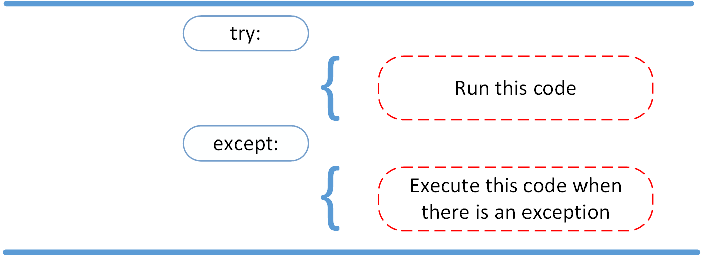

# Class 3

## Readings: FileIO & Exceptions

## Reading and Writing Files in Python (Guide)

### What Is a File?

> At its core, a file is a contiguous set of bytes used to store data. This data is organized in a specific format and can be anything as simple as a text file or as complicated as a program executable. In the end, these byte files are then translated into binary 1 and 0 for easier processing by the computer.

Files on most modern file systems are composed of three main parts:

1. Header: metadata about the contents of the file (file name, size, type, and so on)
2. Data: contents of the file as written by the creator or editor
3. End of file (EOF): special character that indicates the end of the file

What this data represents depends on the format specification used, which is typically represented by an extension,There are hundreds, if not thousands, of file extensions out there.

#### Why it's important?

> it’s important to understand what exactly a file is and how modern operating systems handle some of their aspects.

### File Paths

> When you access a file on an operating system, a file path is required. The file path is a string that represents the location of a file. It’s broken up into three major parts:

1. Folder Path: the file folder location on the file system where subsequent folders are separated by a forward slash / (Unix) or backslash \ (Windows)
2. File Name: the actual name of the file
3. Extension: the end of the file path pre-pended with a period (.) used to indicate the file type

### Line Endings

> There is a standard line ending by both the International Organization for Standardization (ISO) and the American Standards Association (ASA). ASA standard states that line endings should use the sequence of the Carriage Return (CR or \r) and the Line Feed (LF or \n) characters (CR+LF or \r\n). The ISO standard however allowed for either the CR+LF characters or just the LF character.

### Character Encodings

> The two most common encodings are the ASCII and UNICODE Formats. ASCII can only store 128 characters, while Unicode can contain up to 1,114,112 characters.
ASCII is actually a subset of Unicode (UTF-8), meaning that ASCII and Unicode share the same numerical to character values. It’s important to note that parsing a file with the incorrect character encoding can lead to failures or misrepresentation of the character

### Opening and Closing a File in Python

- Main methods
  - Open(file name)
  - close()

> ex:reader = open('dog_breeds.txt')
>
> try:
>
> Further file processing goes here
>
>finally:
>
>reader.close()

Ther is another way to deal with files:
> with open('dog_breeds.txt') as reader:
>
>>Further file processing goes here
>
> The with statement automatically takes care of closing the file once it leaves the with block, even in cases of error. I highly recommend that you use the with statement as much as possible, as it allows for cleaner code and makes handling any unexpected errors easier for you.

Also there is arguments called Modes

| Character | Meaning |
| ----------- | ----------- |
| 'r' | Open for reading (default) |
| 'w' | Open for writing, truncating (overwriting) the file first|
| 'rb' or 'wb' | Open in binary mode (read/write using byte data) |

> There are three different categories of file objects:
>> Text files
>
>>Buffered binary files
>
>>Raw binary files

### Reading and Writing Opened Files

#### Reading

| Method | What It Does |
| ----------- | ---------------- |
| .read(size=-1) | This reads from the file based on the number of size bytes. If no argument is passed or None or -1 is passed, then the entire file is read.|
|.readline(size=-1)|This reads at most size number of characters from the line. This continues to the end of the line and then wraps back around. If no argument is passed or None or -1 is passed, then the entire line (or rest of the line) is read.|
| .readlines()| This reads the remaining lines from the file object and returns them as a list.|

Good example:
> with open('dog_breeds.txt', 'r') as reader:
>> Read and print the entire file line by line 
>> for line in reader:
>> print(line, end='')

output: some text....

> This approach is more Pythonic and can be quicker and more memory efficient. Therefore, it is suggested to use.
>
>The end='' is to prevent Python from adding an additional newline to the text that is being printed and only print what is being read from the file.

#### Writing

| Method | What It Does |
| ----------- | ----------- |
|.write(string) | This writes the string to the file.|
| .writelines(seq)| This writes the sequence to the file. No line endings are appended to each sequence item. It’s up to you to add the appropriate line ending(s).|

### Tips and Tricks

- __file__
  - The __file__ attribute is a special attribute of modules, similar to __name__. It is:
    “the pathname of the file from which the module was loaded, if it was loaded from a file.” (Source)

- We can working With Two Files at the Same Time

- Appending to a File by using mode ('a')

- Creating Your Own Context Manager

- Also we can deal with .csv, .json format

## Important Notes

- You should always make sure that an open file is properly closed.

- To re-iterate, __file__ returns the path relative to where the initial Python script was called. If you need the full system path, you can use os.getcwd() to get the current working directory of your executing code.

- When you try to Creating Your Own Context , using the with statement can no longer be used unless you add a few magic methods: __enter__ and __exit__. By adding these, you’ll have created what’s called a context manager.

- __enter__() is invoked when calling the with statement. __exit__() is called upon exiting from the with statement block.

### [Source](https://realpython.com/read-write-files-python/)

 

## Python Exceptions: An Introduction

### Exceptions versus Syntax Errors

- Syntax errors occur when the parser detects an incorrect statement.
- exception error. This type of error occurs whenever syntactically correct Python code results in an error. The last line of the message indicated what type of exception error you ran into.
Instead of showing the message exception error, Python details what type of exception error was encountered.

### Raising an Exception

We can use raise to throw an exception if a condition occurs. The statement can be complemented with a custom exception.

ex: raise Exception('msg : {}'.format(val))

### The AssertionError Exception

We assert that a certain condition is met, also to avoid the program to crash midway.
ex: assert (condition), "MSG"

### The try and except Block: Handling Exceptions

### Somthing else

- else Clause: lets you code sections that should run only when no exceptions are encountered in the try clause.

- finally enables you to execute sections of code that should always run, with or without any previously encountered exceptions.

## Warnings

- Catching Exception hides all errors…even those which are completely unexpected. This is why you should avoid bare except clauses in your Python programs. Instead, you’ll want to refer to specific exception classes you want to catch and handle.

[Source](https://realpython.com/python-exceptions/)

## Things I want to know more about

All the Warnings & Important Notes in this file.
